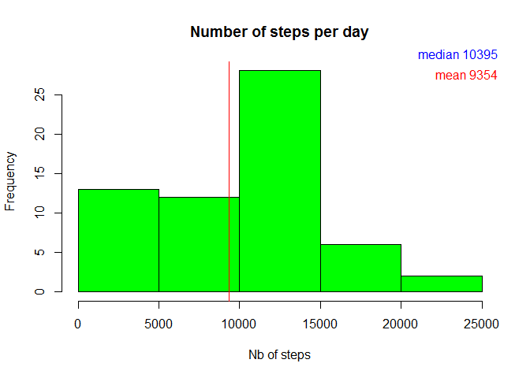
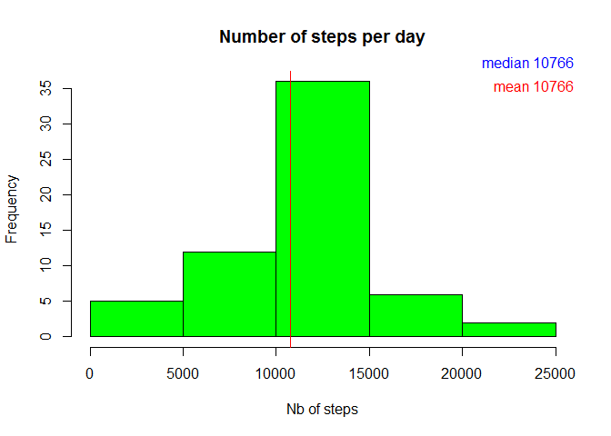

# PA1_template
Michele martin  
10 mars 2016  

This is an R Markdown document. Markdown is a simple formatting syntax for authoring HTML, PDF, and MS Word documents. For more details on using R Markdown see <http://rmarkdown.rstudio.com>.

The file html and docx files are produced by this R markdwon document.

This document contains some basic analysis of Activity monitoring dataset.
The variables included in this dataset are :
* Steps : Number of steps taking in a 5-minute interval
* Dates : The date on which the measurement was taken in YYYY-MM-DD format
* Interval :Identifier for the 5-minute interval in which measurement was taken
The dataset is stored in a comma-separated-value (CSV) file and there are a total of 17,568 observations in this dataset.

# **Loading and preprocessing the data**
The following code reads the csv file into a data set activity

```r
Sys.setlocale("LC_ALL", "English") 
```

```
## [1] "LC_COLLATE=English_United States.1252;LC_CTYPE=English_United States.1252;LC_MONETARY=English_United States.1252;LC_NUMERIC=C;LC_TIME=English_United States.1252"
```

```r
activity<-read.csv("activity.csv",sep=",")
activity$date<-as.Date(as.character(activity$date))
```

#  **what is the mean of total number of steps taken per day?** 
The following histogram shows this quite clearly.
we ignore for now the missing values in the calculaton of the total and mean


```r
library(plyr)
```

```
## Warning: package 'plyr' was built under R version 3.2.2
```

```r
activity_day<-ddply(activity,"date",summarise,Totsteps=sum(steps,na.rm=TRUE))
hist(activity_day$Totsteps,main="Number of steps per day",xlab="Nb of steps", col="green")
abline(v=mean(activity_day$Totsteps), col="red")
mtext(paste("median", median(activity_day$Totsteps)), col="blue", adj=1)
mtext(paste("mean", round(mean(activity_day$Totsteps),0)), col="red", adj=1, padj=2)
```




#  **which  5 minute interval (across all the days in the dataset) contains the maximum number of steps?** 


1. Let's have a look on the average number of steps taken for each 5-minute interval 


```r
activity_interval <-ddply(activity,"interval",summarise,Meansteps=mean(steps,na.rm=TRUE))
plot(activity_interval$interval, activity_interval$Meansteps, type="l", main="average number of steps by period of day", xlab="5-minute interval", ylab="Mean number of steps")
```


2. We can observe from the graph that the 5-minute interval that contains the max number of steps is somewhere 8AM and  9AM. We can calculate it precisely

```r
print(paste("period of max activity is ", activity_interval[activity_interval$Meansteps==max(activity_interval$Meansteps),1]))
```

```
## [1] "period of max activity is  835"
```

# **Inputing Missing Values**
Note that there are a number of days/intervals where there are missing values (coded as NA). The presence of missing days may introduce bias into some calculations or summaries of the data.

1. let's first see if the presence of missing data is important

```r
print(paste("number of missing values in the Dataset : ", nrow(activity[is.na(activity$steps),])))
```

```
## [1] "number of missing values in the Dataset :  2304"
```
2. as the proportion is important, it could introduce bias into some calculations or summaries of the data, the code hereunder replace the NA value by the mean of the same interval (across all days in the dataset). 

```r
intervalmean<-ddply(activity,"interval", summarise, Meansteps=mean(steps, na.rm=TRUE))
```

3.The results are saved in a new dataset activity_f

```r
activity_f <-activity
activity_f<-merge(activity_f, intervalmean, by="interval")
activity_f[is.na(activity_f$steps),]$steps <-activity_f[is.na(activity_f$steps),]$Meansteps
```


4. we see that  the mean/median of total steps per day has increased by this operation. This corrected mean/median is of better quality as the missing values cause an artificial low mean value.

```r
activity_day<-ddply(activity_f,"date",summarise,Totsteps=sum(steps))
hist(activity_day$Totsteps,main="Number of steps per day",xlab="Nb of steps", col="green")
abline(v=mean(activity_day$Totsteps), col="red")
mtext(paste("median", round(median(activity_day$Totsteps),0)), col="blue", adj=1)
mtext(paste("mean", round(mean(activity_day$Totsteps),0)), col="red", adj=1, padj=2)
```




# **Are there differences in activity patterns between weekdays and weekends?**. 
We will use our new dataset to analyse this.

1. we add a new factor in the dataset indicating whether a given date is a weekday or weekend day. 

```r
activity_f$period<-weekdays(activity_f$date)
tweek <-c("Monday","Tuesday","Wednesday","Thursday", "Friday")
activity_f$period[activity_f$period %in% tweek] <-"weekday"
activity_f$period[activity_f$period !="weekday"] <-"weekend"
activity_f$period<-as.factor(activity_f$period)
```

2. If we compare the average of total steps per 5-minute interval observed during the week and the one observed during the weekend, we can observe that the number of steps is higher in the weekend for the interval 20-21h while it is lower for the interval around 8-9h. The results are more evenly distributed during the week-end.


```r
library(ggplot2)
```

```
## Warning: package 'ggplot2' was built under R version 3.2.3
```

```r
activity_interval <-ddply(activity_f,c("interval","period"),summarise,Meansteps=mean(steps))
qplot(interval, Meansteps, data=activity_interval,facets=period ~., geom="line")
```


